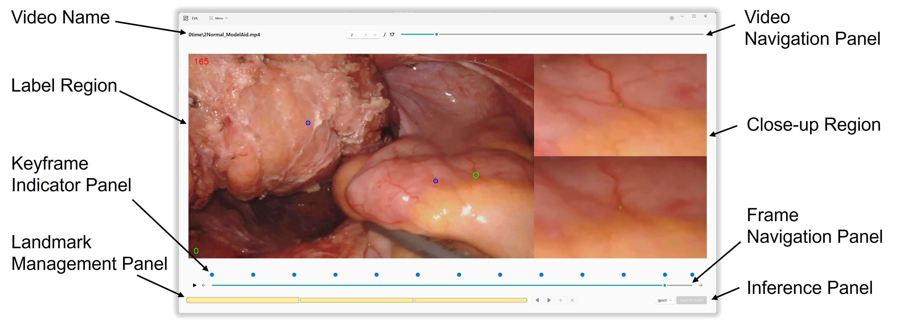
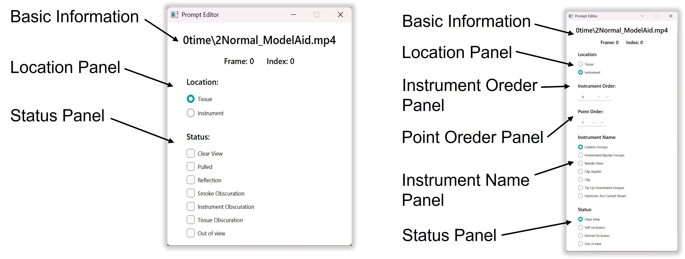
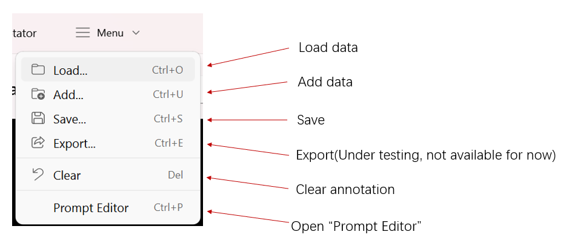
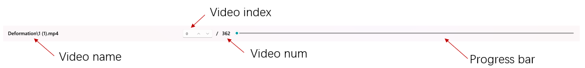
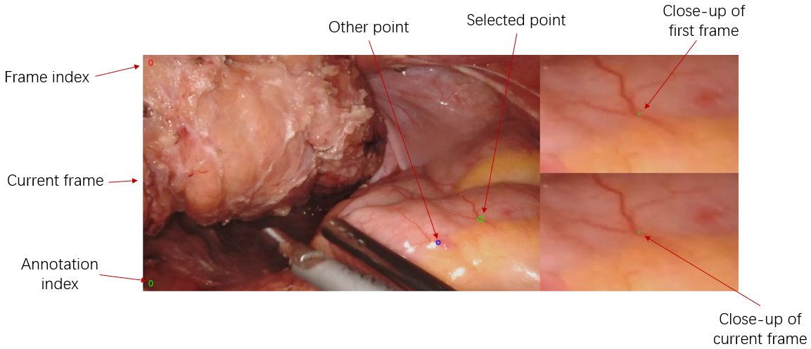
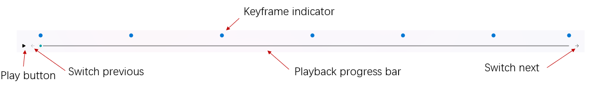
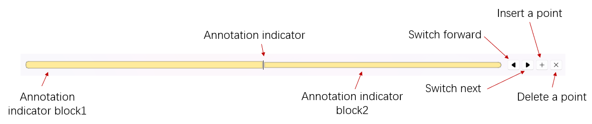
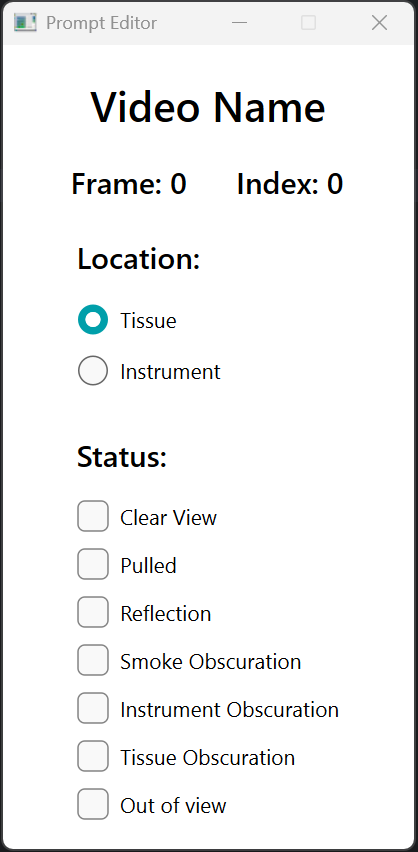
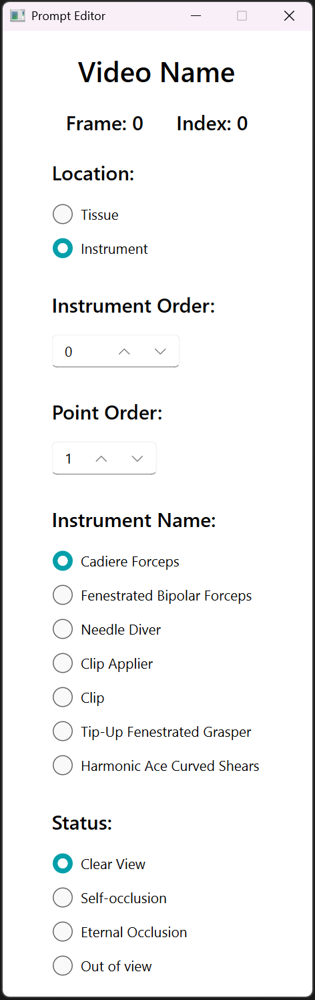
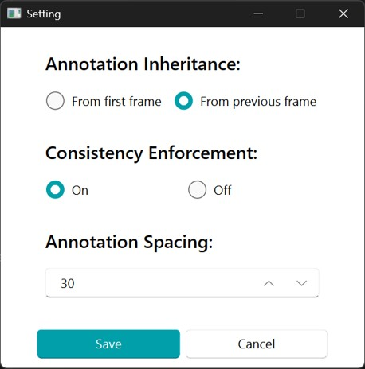

# **EndoSMAP: A Semi-automatic Multimodal Annotation Software for Endoscopic Point Tracking**

This project has developed a graphical annotation system based on **PyQt**, designed for **point tracking** annotation of **tissues** and **instruments** in **endoscopic videos**. The software consists of a **Main Window** and a **Prompt Annotation Window**, responsible for coordinate annotation and textual prompt input, respectively. To enhance annotation efficiency, we deployed the **[MFT](https://github.com/serycjon/MFT)** model via **[ONNX Runtime](https://github.com/microsoft/onnxruntime)**, providing intelligent assistance for point tracking annotation. The system supports core functionalities including assisted auto-annotation, keyframe jumping, and progress management.

---

## 🖼️ 1. Program Interface Overview

The program consists of two windows:

- **Main Window**: responsible for video playback and point coordinate annotation
  
- **Prompt Annotation Window**: responsible for entering additional text information for each annotation point (e.g., status, location, etc.)
  

---

## 📂 2. Menu Bar Introduction

- **Menu Bar**: file and window management
  
- **Menu Bar Shortcuts Table**:


  | Function Name     | Shortcut   | Description                                                                 |
  | ----------------- | ---------- | --------------------------------------------------------------------------- |
  | **Load**          | `Ctrl + O` | Load data from a specified location                                         |
  | **Add**           | `Ctrl + U` | Add data at a specified location without overwriting previously loaded data |
  | **Save**          | `Ctrl + S` | Save annotations of the current video                                       |
  | **Clear**         | `Delete`   | Delete annotation of the currently selected point (⚠️ irreversible)       |
  | **Export**        | `Ctrl + E` | Export data (feature under testing, coming soon)                            |
  | **Prompt Editor** | `Ctrl + P` | Open the prompt annotation window                                           |

---

## 🎬 3. Main Interface Introduction

### 3.1 Video Switching Module

- **Video Switching Module**: displays and manages videos in the dataset and shows the current video name
  
- **Video Switching Module Features**:


  | Feature      | Description                                                     |
  | ------------ | --------------------------------------------------------------- |
  | Video name   | Displays the current video path in dataset                      |
  | Video index  | Input or use keys to switch videos; switching saves annotations |
  | Video num    | Displays total number of videos in dataset                      |
  | Progress bar | Drag to switch videos                                           |

---

### 3.2 Video Playback Module

- **Video Playback Module**: plays videos and displays related info
  
- **Video Playback Features**:


  | Feature                   | Description                                                          |
  | ------------------------- | -------------------------------------------------------------------- |
  | Current frame             | Plays current frame and supports mouse clicks for adding annotations |
  | Frame index               | Shows current frame index                                            |
  | Close-up of first frame   | Shows selected point close-up in the first frame                     |
  | Close-up of current frame | Shows selected point close-up in the current frame                   |
  | Annotation Display        | Highlights selected point (green) vs other points                    |

---

### 3.3 Playback Control Module

- **Playback Control Module**: manages video playback and keyframe jumping
  
- **Playback Control Features**:


  | Feature               | Description                                                                         |
  | --------------------- | ----------------------------------------------------------------------------------- |
  | Play button           | Play / Pause video                                                                  |
  | Switch prev / next    | Step backward / forward by one frame                                                |
  | Playback progress bar | Drag to jump to any frame                                                           |
  | Keyframe indicators   | Shows frames that require annotation (e.g., every 30 frames); clickable for jumping |

---

### 3.4 Annotation Point Management Module

- **Annotation Point Management Module**: manages annotation points
  
- **Annotation Point Management Module Features**:


  | Feature                | Description                                       |
  | ---------------------- | ------------------------------------------------- |
  | Switch prev/next point | Switch selected annotation point                  |
  | Insert a point         | Insert a new annotation point at current position |
  | Delete a point         | Delete currently selected annotation point        |

### 3.5 Tracker Module

- **Tracker Module**: get point tracking prediction results
  

---

### 3.6 Shortcut Keys (Only Active in Video Area)

- **Shortcut Keys List**: these shortcuts only work when the main window is focused


  | Action                             | Shortcut                                   |
  | ---------------------------------- | ------------------------------------------ |
  | Add / Overwrite annotation point   | Left mouse click                           |
  | Delete annotation at current frame | Right mouse click (⚠️ irreversible)      |
  | Switch frame                       | Mouse wheel / frame switch buttons         |
  | Switch keyframe                    | Shift + Mouse wheel / frame switch buttons |
  | Switch current annotation point    | Shift + Ctrl + Mouse wheel                 |
  | Switch video                       | Ctrl + Mouse wheel                         |
  | Fine-tune annotation coordinates   | Arrow keys (↑ ← ↓ →)                   |

---

## 📝 4. Prompt Annotation Window Introduction

Used for entering attribute information of each point, divided into tissue points and instrument points.

### Tissue Annotation Fields

- **Tissue Annotation Page**: annotate prompt information for tissue points
  
- **Tissue Prompt Types**:


  | Field    | Description                                         |
  | -------- | --------------------------------------------------- |
  | Location | Description of point location (Tissue)              |
  | Status   | Point status, including occlusion and motion status |

### Instrument Annotation Fields

- **Instrument Annotation Page**: annotate prompt info for instrument points
  
- **Instrument Prompt Types**:


  | Field            | Description                                 |
  | ---------------- | ------------------------------------------- |
  | Location         | Location of the point on the instrument     |
  | Instrument Order | Current instrument number in video          |
  | Point Order      | Point number on the instrument              |
  | Instrument Name  | Name of the instrument                      |
  | Status           | Point status including occlusion and motion |

---

## ⚙️ 5. Settings & Annotation Assistance

- **Settings Page**: contains software configuration options
  

### Annotation Inheritance

- `ALT + Left Click`: copy annotation info from previous frame or first frame based on settings

Consistency Enforcement

- Locks the number and structure of tags to be consistent with the first frame
- Auto-syncs textual attributes (except for status)
- Checks and warns on structural errors

Annotattion Spacing

- Set the annotation spacing

---

## 🚀 6. Getting Started

This section will guide you through setting up and running the **Endoscopic Video Annotator** on your local machine.

### 6.1 Clone the Repository

```
git clone https://github.com/your-repo/surgical-annotation-tool.git
cd surgical-annotation-tool
```

### 6.2 Python Version

This project is developed and tested with **Python 3.11**.
You can check your version with:

```
python --version
```

### 6.3 Install Dependencies

You can download all you need with:

```
pip install -r requirements.txt
```

If `requirements.txt` is not available or it just not work, you can manually install the dependencies by code:

- `PyQt6` – GUI framework
```
pip install PyQt6
```
- `qfluentwidgets` – Modern Fluent-style widgets
```
pip install PyQt6-Fluent-Widgets
```
- `opencv-python` – Video processing
```
pip install opencv-python
```
- `numpy` –  Array operations
```
pip install numpy
```
- `cupy` –  Compute acceleration(select appropriate version based on your CUDA version)
```
pip install cupy-cuda12x # for CUDA 12.x
```
You can find other version in [offcial website](https://cupy.dev/).
- `onnxruntime` –  Model engine
```
pip install onnxruntime-gpu # with gpu
pip install onnxruntime # without gpu
```
- `tqdm` – Progress bars (only for testing only)
```
pip install tqdm
```

### 6.4 Project Structure

```
EndoSMAP/
├── Main_Window.py                          # Main entry point
├── ui/                                  # UI components
│   ├── VideoPlayer.py
│   ├── AnnotationIndicator.py
│   ├── VideoGroupManager.py
│   ├── VideoProgressBar.py
│   ├── PromptEditor.py
│   ├── PointTrackingWidget.py
│   ├── ProgressBox.py
│   └── SettingPage.py
├── MFT/                                  # MFT files
│   ├── MFT.py
│   ├── point_tracking.py
│   ├── raft.py
│   ├── results.py
│   └── utils.py
├── dataset/                         # Put your dataset inside this floder
├── requirements.txt            # The requirements file
├── run.exe                           # A demo for running
└── ...
```

### 6.5 Dataset File Structure

```
EndoSMAP/dataset/          # Root folder for a dataset (not necessarily in EndoSMAP)
├── classification/        # Classification root folder (must exist)
│   ├── class_1/           # Video classification subfolder (must exist)
│   │   ├── video_001.mp4
│   │   └── ...
│   ├── class_2/
│   │   └── ...
│   └── ...
├── log/                   # Log root folder (must exist)
│   ├── class_1/           # Same classification subfolders as classification/ (generated by program)
│   ├── class_2/
│   └── ...
├── annotations/           # Annotation files
└── metadata.json          # (Optional) Dataset-wide metadata
```

* `classification/`
  Contains video classification folders, each with corresponding videos.
* `log/`
  Has the same classification folder structure as `classification/`. Files inside are created automatically by the program.
  Users must ensure that `classification/` and `log/` folders exist before running the program.
  Annotations are stored in the `log/` folder in `JSON` format.

### 6.6 Running the Application

Run `EndoSMAP/Main_Window.py` to get start.

### 6.7 Annotation Workflow

* Press `Ctrl+P` to open the **Prompt Editor** and assign textual attributes. (Optional)
* Load a dataset (with folder of `classification/` and `log/`).
* Use the main window to play the video and click to annotate point locations.
* Use the `Switch next button` of  `Annotation Point Management Module` while you are selecting the final point to add a new point at the end.
* Navigate between frames or videos, with support for keyframe jumping and coordinate fine-tuning.
* Using `Ctrl+S` or simply switch to another video to save annotations.

### 6.8 Optional: Settings & Automation

You can enable helpful features like:

* **Auto Fill**: `Alt + Left Click`
* **Simplify Annotation**: Open in setting

---
