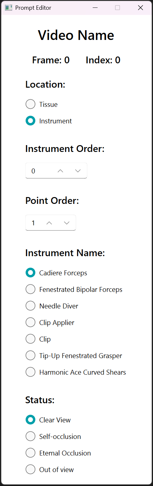

# **EVA: Endoscopic Video Annotator​**

This project is a graphical annotation system developed based on ​**PyQt**​, designed for ​**point tracking annotation of tissues and instruments in surgical videos**​. The software consists of **Main Window** and ​**Prompt Annotation Window**​, which handle coordinate annotation and textual prompt respectively. It supports assisted auto-annotation, keyframe jumping, and progress management.

---

## 🖼️ 1. Program Interface Overview

The program consists of two windows:

- ​**Main Window**​: responsible for video playback and point coordinate annotation
  
- ​**Prompt Annotation Window**​: responsible for entering additional text information for each annotation point (e.g., status, location, etc.)
  

---

## 📂 2. Menu Bar Introduction

- ​**Menu Bar**​: file and window management
  
- ​**Menu Bar Shortcuts Table**​:
  | Function Name           | Shortcut       | Description                                                                 |
  | ------------------------- | ---------------- | ----------------------------------------------------------------------------- |
  | **Load**          | `Ctrl + O` | Load data from a specified location                                         |
  | **Add**           | `Ctrl + U` | Add data at a specified location without overwriting previously loaded data |
  | **Save**          | `Ctrl + S` | Save annotations of the current video                                       |
  | **Clear**         | `Delete`   | Delete annotation of the currently selected point (⚠️ irreversible)       |
  | **Export**        | `Ctrl + E` | Export data (feature under testing, coming soon)                            |
  | **Prompt Editor** | `Ctrl + P` | Open the prompt annotation window                                           |
  
  

---

## 🎬 3. Main Interface Introduction

### 3.1 Video Switching Module

- ​**Video Switching Module**​: displays and manages videos in the dataset and shows the current video name
  
- ​**Video Switching Module Features**​:
  | Feature              | Description                                                     |
  | ---------------------- | ----------------------------------------------------------------- |
  | Video name           | Displays the current video path in dataset                      |
  | Video index   | Input or use keys to switch videos; switching saves annotations |
  | Video num   | Displays total number of videos in dataset                      |
  | Progress bar | Drag to switch videos                                           |
  
  

---

### 3.2 Video Playback Module

- ​**Video Playback Module**​: plays videos and displays related info
  
- ​**Video Playback Features**​:
  | Feature                | Description                                                          |
  | ------------------------ | ---------------------------------------------------------------------- |
  | Current frame     | Plays current frame and supports mouse clicks for adding annotations |
  | Frame index     | Shows current frame index                                          |
  | Close-up of first frame   | Shows selected point close-up in the first frame                     |
  | Close-up of current frame | Shows selected point close-up in the current frame                   |
  | Annotation Display     | Highlights selected point (green) vs other points                    |
  
  

---

### 3.3 Playback Control Module

- ​**Playback Control Module**​: manages video playback and keyframe jumping
  
- ​**Playback Control Features**​:
  | Feature               | Description                                                                         |
  | ----------------------- | ------------------------------------------------------------------------------------- |
  | Play button       | Play / Pause video                                                                  |
  | Switch prev / next      | Step backward / forward by one frame                                                |
  | Playback progress bar | Drag to jump to any frame                                                           |
  | Keyframe indicators   | Shows frames that require annotation (e.g., every 30 frames); clickable for jumping |
  
  

---

### 3.4 Annotation Point Management Module

- ​**Annotation Point Management Module**​: manages annotation points
  
- **Annotation Point Management Module​ Features​**:
  | Feature                 | Description                                       |
  | ------------------------- | --------------------------------------------------- |
  | Switch prev/next point  | Switch selected annotation point                  |
  | Insert a point | Insert a new annotation point at current position |
  | Delete a point | Delete currently selected annotation point        |
  
  

---

### 3.5 Shortcut Keys (Only Active in Video Area)

- ​**Shortcut Keys List**​: these shortcuts only work when the main window is focused
  | Action                             | Shortcut                              |
  | ------------------------------------ | --------------------------------------- |
  | Add / Overwrite annotation point   | Left mouse click                      |
  | Delete annotation at current frame | Right mouse click (⚠️ irreversible) |
  | Switch frame                       | Mouse wheel / frame switch buttons    |
  | Switch keyframe                    | Shift + Mouse wheel / frame switch buttons         |
  | Switch current annotation point    | Shift + Ctrl + Mouse wheel            |
  | Switch video                       | Ctrl + Mouse wheel                    |
  | Fine-tune annotation coordinates   | Arrow keys (↑ ← ↓ →)              |
  
  

---

## 📝 4. Prompt Annotation Window Introduction

Used for entering attribute information of each point, divided into tissue points and instrument points.

### Tissue Annotation Fields

- ​​**Tissue Annotation Page**​: annotate prompt information for tissue points
  
- ​**Tissue Prompt Types**​:
  | Field    | Description                                         |
  | ---------- | ----------------------------------------------------- |
  | Location | Description of point location (Tissue)              |
  | Status   | Point status, including occlusion and motion status |
  
  

### Instrument Annotation Fields

- ​**Instrument Annotation Page**​: annotate prompt info for instrument points
  
- ​**Instrument Prompt Types**​:
  | Field            | Description                                 |
  | ------------------ | --------------------------------------------- |
  | Location         | Location of the point on the instrument     |
  | Instrument Order | Current instrument number in video          |
  | Point Order      | Point number on the instrument              |
  | Instrument Name  | Name of the instrument                      |
  | Status           | Point status including occlusion and motion |
  
  

---

## ⚙️ 5. Settings & Annotation Assistance

- ​**Settings Page**​: contains software configuration options
  

### Auto-fill Settings

- `ALT + Left Click`: copy annotation info from previous frame or first frame based on settings

### Simplified Annotation Mode

- Locks the number and structure of tags to be consistent with the first frame
- Auto-syncs textual attributes (except for status)
- Checks and warns on structural errors

---

## 🚀 6. Getting Started

This section will guide you through setting up and running the **Endoscopic Video Annotator** on your local machine.

### 6.1 Clone the Repository

```
git clone https://github.com/your-repo/surgical-annotation-tool.git
cd surgical-annotation-tool
```

### 6.2 Python Version

This project is developed and tested with ​**Python 3.11**​.
You can check your version with:

```
python --version
```

### 6.3 Install Dependencies


 You can download all you need with:

```
pip install -r requirements.txt
```

If `requirements.txt` is not available or it just not work, you can manually install the following dependencies:

- `PyQt6` – GUI framework
- `qfluentwidgets` – Modern Fluent-style widgets
- `opencv-python` – Video processing
- `tqdm` – Progress bars (only for testing only)

### 6.4 Project Structure

```
EVA/
├── Main_Window.py                          # Main entry point
├── ui/                                  # UI components
│   ├── VideoPlayer.py
│   ├── AnnotationIndicator.py
│   ├── VideoGroupManager.py
│   ├── VideoProgressBar.py
│   ├── PromptEditor.py
│   └── SettingPage.py
├── dataset/                         # Put your dataset inside this floder
├── requirements.txt            # The requirements file
├── run.exe                           # A demo for running
└── ...
```

### 6.5 Dataset File Structure

```
EVA/dataset/                 # Root folder for a dataset (not necessarily in EVA)
├── classification/        # Classification root folder (must exist)
│   ├── class_1/           # Video classification subfolder (must exist)
│   │   ├── video_001.mp4
│   │   └── ...
│   ├── class_2/
│   │   └── ...
│   └── ...
├── log/                   # Log root folder (must exist)
│   ├── class_1/           # Same classification subfolders as classification/ (generated by program)
│   ├── class_2/
│   └── ...
├── annotations/           # Annotation files
└── metadata.json          # (Optional) Dataset-wide metadata
```

* `classification/`
  Contains video classification folders, each with corresponding videos.
* `log/`
  Has the same classification folder structure as `classification/`. Files inside are created automatically by the program.
  Users must ensure that `classification/` and `log/` folders exist before running the program.
  Annotations are stored in the `log/` folder in `JSON` format.

### 6.6 Running the Application

Run `EVA/Main_Window.py` to get start.

### 6.7 Quick Start

If you prefer to skip environment setup, you can directly run the pre-packaged executable:

```
EVA/run.exe
```

This will launch the annotation tool without requiring Python or dependency installation.

### 6.8 Annotation Workflow

* Press `Ctrl+P` to open the **Prompt Editor** and assign textual attributes. (Optional)
* Load a dataset (with folder of `classification/` and `log/`).
* Use the main window to play the video and click to annotate point locations.
* Use the `Switch next button` of  `Annotation Point Management Module` while you are selecting the final point to add a new point at the end.
* Navigate between frames or videos, with support for keyframe jumping and coordinate fine-tuning.
* Using `Ctrl+S` or simply switch to another video to save annotations.

### 6.9 Optional: Settings & Automation

You can enable helpful features like:

* ​**Auto Fill**​: `Alt + Left Click`
* ​**Simplify Annotation**​: Open in setting

---


